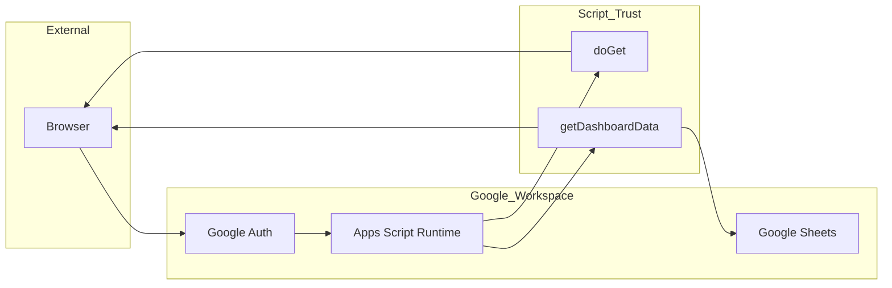

# Security Review: Incentive Dashboard (Google Apps Script)

**Feature Overview:** The Incentive Dashboard is an internal Google Apps Script web application that provides trainers with a personalized view of their weekly task completions, incentive pay tiers, consistency multipliers, and a ranked leaderboard. Data is sourced from a single Google Sheet (`Gold_Testing`). The web app enforces access control by allowing only users whose email appears in the sheet to view the dashboard, and it executes as the accessing user within the Google Workspace domain.

---

**Out of Scope:** This review does not cover: (1) security of the Google Sheets or Google Workspace tenant configuration (sharing, IAM, domain restrictions); (2) security of the clasp/local development toolchain; (3) physical or procedural controls for who is added to the roster sheet; (4) third-party browser extensions or client-side modifications after the page is loaded.

---

# Business & Security Context

**What problem does this feature solve?**

It gives internal trainers a single place to see their own incentive metrics (weekly completions, pay tier progress, consistency multiplier, earnings estimate) and how they rank against peers, reducing ambiguity and encouraging participation in the incentive program.

**What data does it handle?**

- **User data:** Signed-in user’s email (from `Session.getActiveUser().getEmail()`); trainer emails and derived display names from the sheet; weekly completion counts and 4-week averages; leaderboard position and neighbor context.
- **Internal data:** Sheet names, column layout, and all cell data read from `Gold_Testing` (timestamps, emails, status, completion counts).

**What is the impact if this feature is compromised or misused?**

- **Confidentiality:** Exposure of trainer emails, completion counts, and rankings to unauthorized parties; possible exposure of internal sheet structure.
- **Integrity:** Unauthorized changes to sheet data could misstate incentives or leaderboard.
- **Availability:** Abuse of the web app could lead to quota exhaustion, rate limiting, or temporary unavailability of the dashboard.

**Is this feature exposed to the internet or external actors?**

- **Public exposure model:** The web app URL is only accessible to users who can reach the Google Apps Script deployment; with `"access": "DOMAIN"`, only users in the same Google Workspace domain can open it. It is not anonymous public internet.
- **Required authentication level:** Google Workspace sign-in is required; the app runs with `"executeAs": "USER_ACCESSING"`, so the script runs as the signed-in user and has no elevated owner privileges at runtime.
- **Network boundary details:** Clients interact with Google’s infrastructure (Apps Script backend, Sheets). There are no custom servers or open listening ports; egress is to Google only (no external API calls from the dashboard).

---

# Threat Modeling Summary

## Entry Points

| Entry Point | Type | Caller | Parameters | Notes |
|-------------|------|--------|------------|--------|
| `doGet()` | HTTP (GET) | Browser / Google | None | Serves `Index.html`; no user input. |
| `getDashboardData()` | `google.script.run` | Client-side JS | None | Single server entry for dashboard data; identity from `Session.getActiveUser().getEmail()`. |

**Potential vulnerabilities (OWASP / MITRE aligned):**

- **IDOR (A01):** Mitigated by design—no resource IDs in requests; access is strictly “my data” derived from the authenticated user’s email and sheet-backed allow-list. Risk is low provided roster (email column) is maintained correctly.
- **SSRF (CWE-918):** Not applicable—the dashboard does not make outbound HTTP requests; no `UrlFetchApp` or user-controlled URLs.
- **Injection (A03, CWE-20/89/78/94):** No SQL, shell, or external API calls; no user input passed to queries. Risk is low.
- **Sensitive data exposure (A02, CWE-200):** Error messages are shown to the client via `withFailureHandler` (e.g., sheet name in “Sheet not found”); exception logging goes to Stackdriver. No API credentials are used by the dashboard (see Consolidated Risk List).
- **XSS (CWE-79):** Client uses `escapeHtml()` for leaderboard names and `textContent` for most server data; one `innerHTML` usage with a numeric/controlled value (avg). Overall risk is low; see Output Encoding section.

---

## Trust Boundaries

**Boundary summary:** The browser is untrusted; the user identity boundary is at Google Auth. Apps Script code and Sheets are inside the Google Workspace boundary. The dashboard does not accept user-supplied parameters and does not call external APIs.

---

## Assets

| Asset | Location | Sensitivity | Protection |
|-------|----------|-------------|------------|
| Trainer emails & display names | Sheet (COL_EMAIL), server memory, client response | Medium | Access control via email allow-list; client sees only roster + leaderboard subset |
| Weekly completions & 4-week avg | Sheet, server, client | Medium | Same as above; used for pay and multiplier logic |
| Leaderboard ranking & “your position” | Derived server-side, sent to client | Medium | Scoped to authenticated user and roster |
| Sheet structure (names, columns) | Code + Sheet | Low–Medium | Error messages may reveal sheet name |
| User’s own email | Session, response | Low | Shown in subtitle for UX |

---

# Security Control Checklist

---

## Authentication (OWASP A07)
hentication flow:** Google Apps Script web app relies entirely on Google Workspace authentication. The client does not implement a custom login; `getDashboardData()` uses `Session.getActiveUser().getEmail()` to identify the user. With `executeAs: USER_ACCESSING`, the script runs as the signed-in user.
- **Token management:** No application-level tokens; Google manages session/cookies. No token expiration logic in app code.
- **MFA:** Governed by Google Workspace admin policy; not configurable in this project.
- **Cookies:** Handled by Google (e.g., `Hosted` / Google session cookies). The app does not set custom cookies.
- **Session fixation / hijacking:** Session is managed by Google; the app does not expose session identifiers. Risk is aligned with Google’s own session security and domain restriction (`DOMAIN` access).

**Assessment:** Authentication is delegated to Google Workspace; design is appropriate for an internal domain-restricted app. Ensure domain and sharing settings match intent (only intendeorg can open the deployment).

---

## Authorization (OWASP A01)

- **IDOR:** The only “resource” is the current user’s dashboard. There are no request parameters (e.g., user ID or email) that could be manipulated to access another user’s data. Authorization is “am I in the roster?” (email in sheet column). No IDOR path identified.
- **Privilege escalation:** No roles or admin endpoints in the web app. Escalation would require either (1) adding the attacker’s email to the sheet roster (governed by who can edit the sheet) or (2) compromising a user who is already on the roster.
- **Resource-scoped checks:** Single check: `emailValues.includes(email)` after reading the email column. Centralized in `getDashboardData()`; no alternate code paths that return data without this check.
- **Least privilege:** Script runESSING`; it can only read/write Sheets and call URLs with the same permissions as the deploying user for triggers, but at runtime the executing user’s permissions apply for the web app.
- **Multi-tenant:** Single tenant (one org); “tenant” separation is roster-based (only listed emails see data). Separation depends on integrity of the sheet and who can edit it.

**Assessment:** Authorization is simple and centralized. Main residual risk is roster management (who can add/remove emails and edit the sheet).

---

## Input Validation and Injection Risks (OWASP A03, CWE 20/89/78/94)

- **SQL / NoSQL / command / path:** No databases or shell execution; no path construction from user input. N/A.
- **Server-Side Template Injection:** No user-controlled templates. N/A.
- **Deserialization:** No deserialization of untrusted or user-supplied data in the dashboard. N/A.
- **File upload / handling:** None. N/A.
- **User input:** The web only server entry (`getDashboardData()`) accepts no parameters. All “input” is identity from Session and data read from the sheet. Sheet data is not validated as “safe” for downstream use (e.g., names are derived and then escaped on output). No injection vector identified.

**Assessment:** No user-controlled input to server logic; injection risk is low.

---

## Output Encoding and Cross-Site Scripting (CWE 79)

- **Leaderboard names:** Rendered with `escapeHtml(r.name)` before insertion into `innerHTML` in both `renderLeaderList` and `renderYourPosition`. Names are derived from emails (e.g., `emailToName_`) so escaping is appropriate.
- **Numeric / server-controlled fields:** `rank`, `weeklyCompletions` are numbers; badge text and tier text are server-controlled strings and set via `textContent` in most places.
- **Subtitle / earnings / notes:** Set with `textContent` (e.g., `data.earnin, `data.additionalPay.qualifiedText`), except one case below.
- **avgText:** Uses `innerHTML` with `4-week average: <b>${avgNum}</b> completion(s)`. `avgNum` is either a number (`data.fourWeekAvg`) or the literal `'—'`. No user-controlled or unsanitized string; risk is minimal. Prefer `textContent` for the whole sentence and a `<b>` in the DOM, or ensure `avgNum` is always a number or a safe literal to avoid future regressions.
- **showNoAccess():** Replaces `document.body.innerHTML` with a static template string; no user or server data interpolated. Safe.

**Assessment:** XSS risk is low. Client-side encoding is applied where untrusted or sheet-derived data (names) is rendered; one minor hardening opportunity is to avoid `innerHTML` for `avgText` or to strictly type/sanitize `avgNum`.

---

## Data Protection and Cryptography (OWASP A02)

- **TLS:** All client traffic to Apps Script and Sheets is over HTTPS (Google-managed). No custom TLS configuration in code. The dashboard does not call external APIs.
- **Encryption at rest:** Sheets and script project storage are under Google’s control.
- **Keys / certificates:** No custom key or cert handling; the dashboard does not use API tokens or external credentials.
- **Hardcoded keys:** The dashboard codebase does not include Hubstaff or Roster sync scripts; no external API credentials are used by the remaining application.
- **Algorithms:** No cryptographic primitives used in application code. N/A.
- **Sensitive user data:** Emails and completion data are stored in Sheets; the app returns only what is needed for the dashboard (scoped to the user and leaderboard). No unnecessary PII in logs if logging is added later.

**Assessment:** TLS and storage are handled by the platform. The dashboard has no external API dependencies.

---

## Secrets Management

- **Approved vault:** The dashboard does not call external APIs; no API tokens or credentials are used by the current application. If future features require secrets, Google Apps Script PropertiesService is the appropriate store.
- **Secrets in code / env / config / pipelines:** Hubstaff and Roster sync scripts have been removed; the remaining codebase does not contain API tokens or other secrets. No `.env` or config files with secrets should be committed.
- **Rotation:** N/A for current scope; no application-level secrets.
- **Scoping:** N/A for current scope.

**Assessment:** The dashboard has no external credential dependencies. If secrets are added in the future, use PropertiesService only.

---

## Software Supply Chain & Build Integrity (OWASP A08)

- **Dependencies:** `appsscript.json` shows `"dependencies": {}`. No external npm or library dependencies; only Apps Script built-in services. No dependency pinning or lockfile in the repo.
- **SBOM / dependency confusion:** Not applicable for a dependency-free Apps Script project.
- **CI/CD / signed artifacts:** Deployment is typically via clasp or manual “Deploy” in the script editor; no CI/CD or artifact signing referenced in the repo.
- **Insecure /recated packages:** No third-party packages used.

**Assessment:** Supply chain surface is minimal. If the project later adds clasp or CI, consider documenting the deployment path and ensuring no secrets are injected via build env.

---

## Security Misconfiguration (OWASP A05)

- **Security headers:** The app uses `HtmlService.createHtmlOutputFromFile('Index').setXFrameOptionsMode(HtmlService.XFrameOptionsMode.DEFAULT)`. DEFAULT allows framing by same-origin; consider `DENY` or `ALLOWALL` only if embedding is required, to reduce clickjacking surface.
- **CORS:** Governed by Google Apps Script; `google.script.run` is same-origin to the script. No custom CORS in code.
- **Debug endpoints:** No debug routes; only `doGet` and `getDashboardData` exposed to the client.
- **Default credentials:** None in code; no external API credentials used.
- **IAM / network:** App runs in Google’s environment; access is controlled by `weba.access: DOMAIN` and Google Workspace. No custom IAM or firewall in repo.

**Assessment:** Configuration is minimal and reasonable. Optional hardening: restrict iframe embedding via XFrameOptions if not needed.

---

## Logging, Monitoring, and Alerting (OWASP A09, CWE 200)

- **Exception logging:** `appsscript.json` has `"exceptionLogging": "STACKDRIVER"`; uncaught exceptions are sent to Stackdriver. No application-level logging of requests or auth events.
- **Sensitive data in logs:** No explicit log statements in the reviewed code; Stackdriver may capture error messages (e.g., “Sheet not found”) which can include sheet name. Avoid logging emails or completion data if custom logging is added.
- **Audit trail:** No built-in audit log for “who called getDashboardData when.” Google Admin and Apps Script execution logs can provide some trail. For stricter compliance, consider documenting how to use those logs or addial, non-PII event logging.
- **Alerting:** No integration with an alerting platform in the codebase; relies on Google/Stackdriver if configured at the tenant level.

**Assessment:** Basic exception visibility exists; no sensitive logging in code. Recommend defining what “audit” means for this app and whether execution logs alone are sufficient.

---

## Abuse Protection, CSRF, SSRF, Rate Limiting (OWASP A04/A10)

- **Rate limiting:** No application-level rate limiting. Google Apps Script enforces quota (e.g., UrlFetchApp, script run time); excessive calls could hit quota and affect availability. No brute-force protection beyond Google sign-in.
- **Anti-automation:** Not implemented; same as above.
- **CSRF:** `google.script.run` is used with same-origin and Google-managed tokens;s Script mitigates classic CSRF for these calls. No state-changing GET; the only mutation is “load data.” Risk is low.
- **SSRF:** The dashboard does not make outbound HTTP requests; no `UrlFetchApp` or user-controlled URLs. SSRF is not applicable.
- **Redirects / URLs:** No redirect logic or user-supplied URLs in the app.

**Assessment:** No custom rate limiting or anti-abuse; acceptable for an internal, domain-restricted app. SSRF/CSRF risk is low given current design.

---

## Error Handling

- **Stack traces:** Server exceptions are passed to the client via `withFailureHandler(function (err) { alert(err.message || err); })`. Only `err.message` (or the error object string) is shown; full stack traces are not explicitly sent to the client but could be present in the string in some environments. Stackdriver receives the full exception.
- **Sensitive details:*ror messages such as `Sheet "${SHEET_NAME}" not found` expose the internal sheet name (`Gold_Testing`). “Unable to determine your email…” is generic. Recommend generic user-facing messages (“Something went wrong. Please try again or contact support.”) and log details server-side or in Stackdriver only.
- **Consistency:** Both success and failure paths return; no crash-to-client. Failure handler could be improved to avoid exposing internal messages.

**Assessment:** Errors are handled but may leak minor internal details (sheet name). Recommend sanitizing user-facing error messages and keeping details in logs only.

---

# Deployment & Configuration Review

- **Infrastructure-as-code:** No Terraform, CloudFormation, or Helm; the project is Apps Script plus optional clasp. `appsscript.json` is the only declarative config. Deployment is manual or via clasp.
- **Secrets injection:** No application-level secrets; no containers or VMs.
- **Network / firewall:** No custom network policies; traffic is to Google only. Domain restriction limits who can open the web app.
- **Container / image:** N/A; serverless Apps Script runtime.
- **New endpoints:** Only one web-visible server function (`getDashboardData`). Adding new `google.script.run` endpoints would expand attack surface and should be reviewed.
- **Runtime config:** Timezone and webapp settings in `appsscript.json`; no runtime env files. Sheet name and column indices are in code constants—changes require code change and redeploy.

**Assessment:** Deployment is standard for Apps Script. Ensure Script Properties are set correctly for each environment and that domain access matches policy.

---

# Consolidated Risk List

| # | Risk description | Severity | OWASP | CWE | Recommended remediation | Effort |
|---|-------------------|----------|-------|-----|-------------------------|--------|
| 1 | User-facing error messages expose internal details (e.g., sheet name “Gold_Testing”) | **Medium** | A04 | CWE-209 | Return generic messages to the client (e.g., “Something went wrong”); log full message/stack in Stackdriver or avoid including sensitive identifiers in thrown messages. | Low |
| 2 | `innerHTML` used for `avgText` with interpolated value; low risk today but fragile | **Low** | A03 | CWE-79 | Set text via `textContent` or ensure `avgNum` is always a number or a fixed safe string; use a `<b>` element for emphasis without raw HTML interpolation. | Low |
| 3 | XFrameOptions set to DEFAULT (allows same-origin framing); possible clickjacking | **Low** | A05 | CWE-1021 | If the app must not be embedded, use `HtmlService.XFrameOptionsMode.DENY`. Otherwise document that same-origin framing is acceptable. | Low |
| 4 | No application-level rate limiting on `getDashboardData()` | **Low** | A04 | CWE-770 | Rely on Google quotas or add optional rate limiting (e.g., cache per user with expiration) if abuse is observed. Document reliance on platform quotas. | Medium |
| 5 | Roster (email allow-list) and sheet edit permissions govern access | **Medium** | A01 | CWE-284 | Document who can edit the `Gold_Testing` sheet and roster column; use Sheet permissions and/or audit logs to prevent unauthorized roster changes. | Process |
| 6 | No audit logging of dashboard access | **Low** | A09 | CWE-778 | Rely on Apps Script execution logs and Google Admin; or add minimal, non-PII logging (e.g., “dashboard loaded”) if compliance requires it. | Low–Medium |

---

# Reviewer Notes (Security Architect)

- **Scope:** This review is based on the codebase as provided. Hubstaff and Roster sync scripts have been removed; the application consists of the web dashboard only (Code.js, Index.html) reading from the `Gold_Testing` sheet.
- **Architecture:** The design is appropriate for an internal, domain-restricted dashboard: single server entry, no user-supplied parameters, identity from Google Session, and roster-based authorization. No external API calls. Main residual risks are minor information disclosure in errors and dependency on sheet/roster governance.
- **Next steps:** (1) Sanitize user-facing error messages; (2) Optionally harden `avgText` and XFrameOptions; (3) Document roster and sheet ownership and deployment procedures.
- **Re-review:** Recommend a lightweight re-check if new server-side entry points, user inputs, or external API integrations are added.

